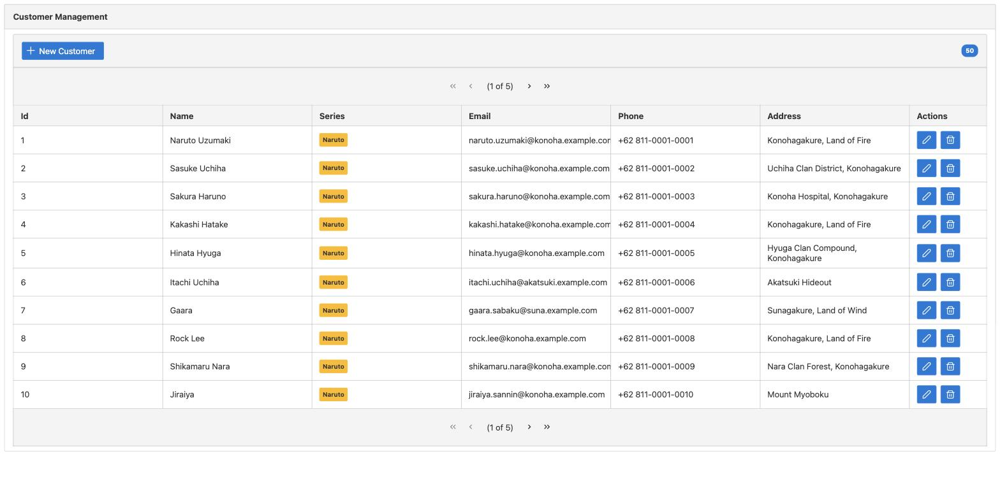

# spring-boot-prime-faces-crud

A simple Customer CRUD application built with Spring Boot, JSF, and PrimeFaces, backed by an
in-memory H2 database.



## Tech Stack

- Java 25
- Spring Boot 4.1.0
- JoinFaces (JSF + PrimeFaces integration for Spring Boot)
- PrimeFaces 15
- Spring Data JPA / Hibernate
- H2 (in-memory database)
- Lombok
- Gradle

## Features

- List, create, update, and delete customers
- PrimeFaces data table with an edit/create dialog
- Auto-created schema on startup (`Hibernate ddl-auto: update`)
- H2 web console for inspecting the database

## Prerequisites

- JDK 25

## Running the Application

```bash
./gradlew bootRun
```

The application starts on [http://localhost:8080](http://localhost:8080) and redirects to the
customer list at [http://localhost:8080/customers.xhtml](http://localhost:8080/customers.xhtml).

## H2 Console

The H2 web console is available at [http://localhost:8080/h2-console](http://localhost:8080/h2-console).

Use the following connection settings:

| Field    | Value                                      |
|----------|--------------------------------------------|
| JDBC URL | `jdbc:h2:mem:customerdb;DB_CLOSE_DELAY=-1` |
| Username | `naruto`                                   |
| Password | `53Cret`                                   |

## Running Tests

```bash
./gradlew test
```
